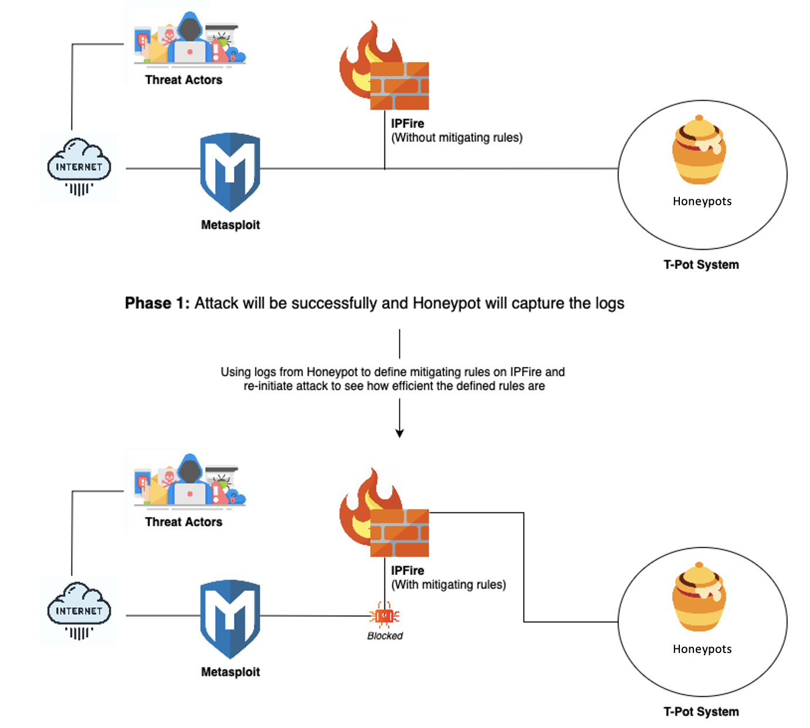
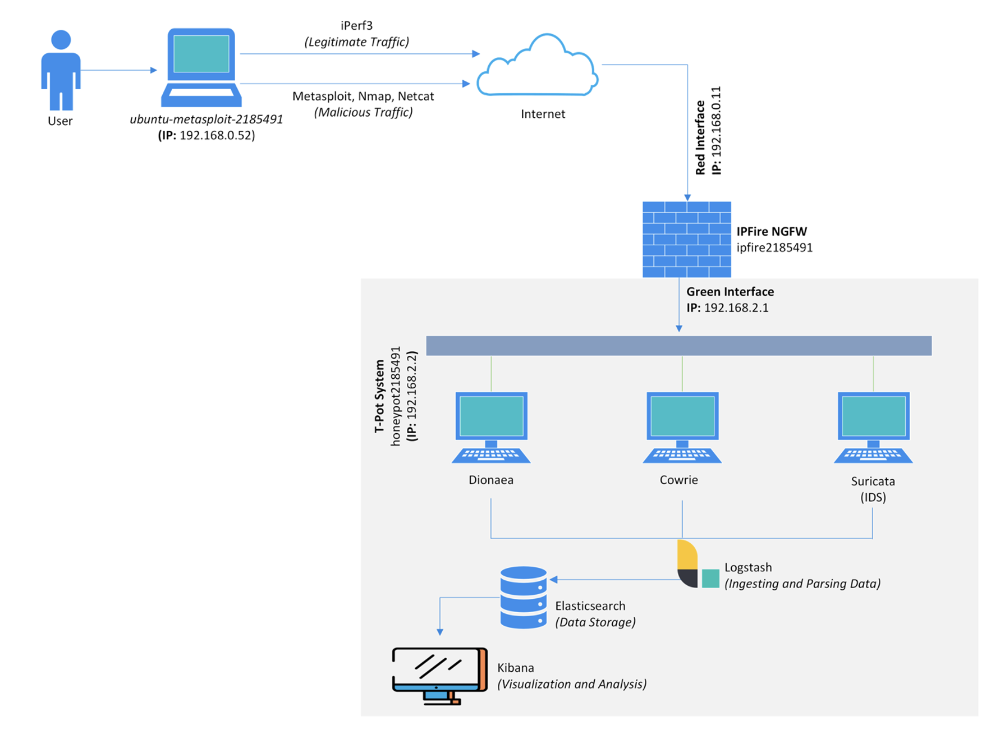
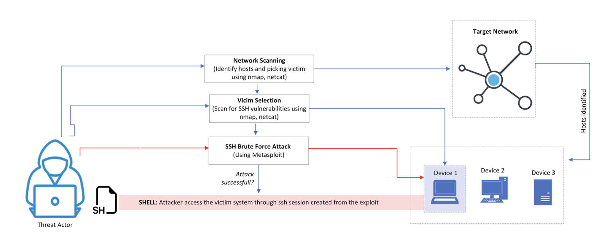
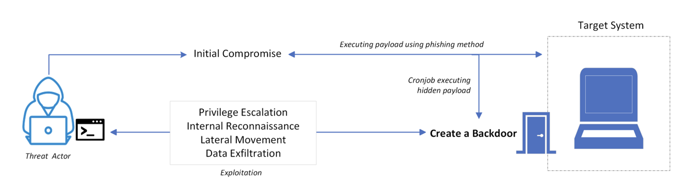
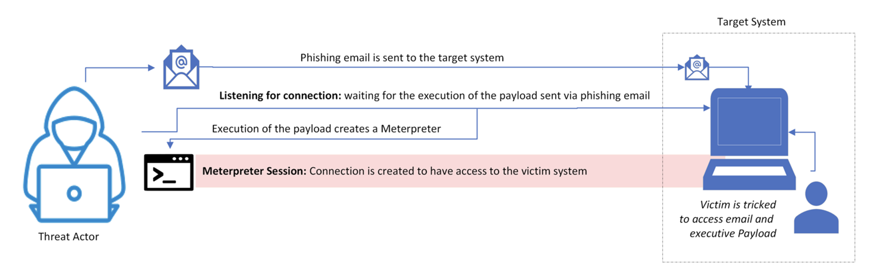
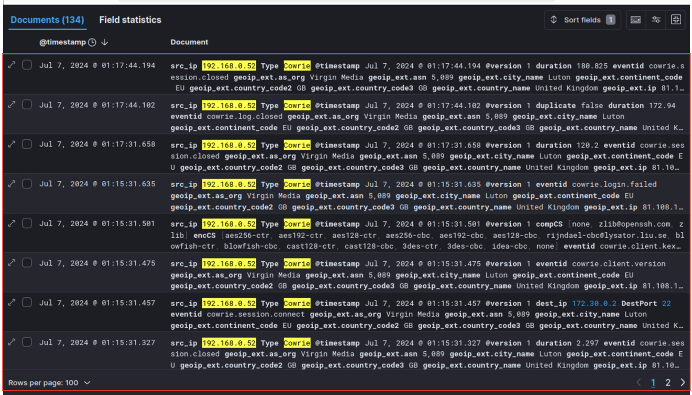
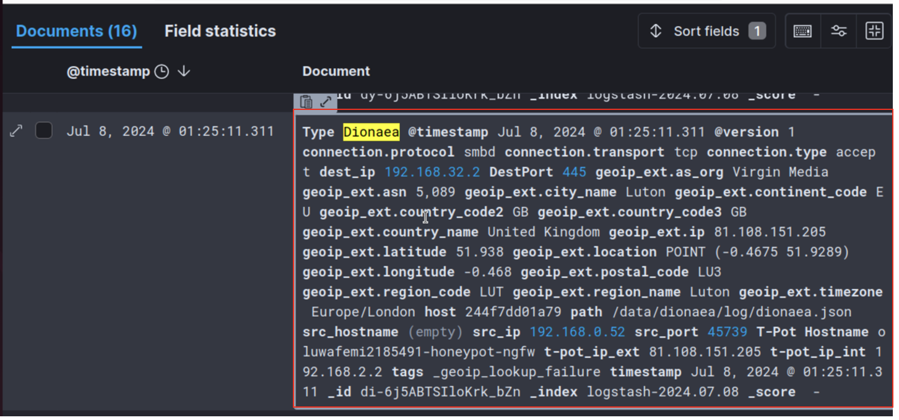
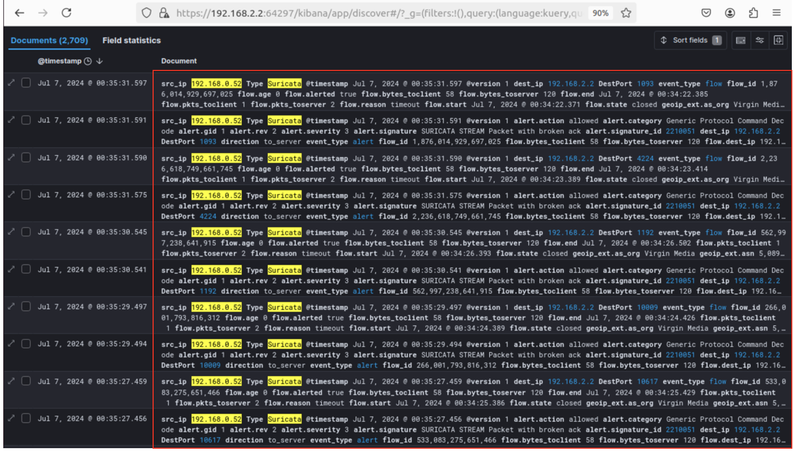
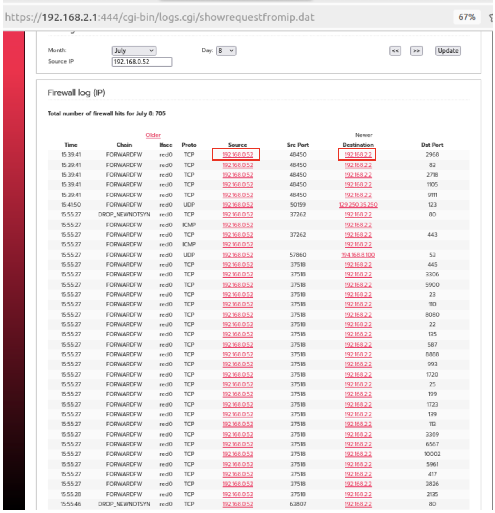

# 🛡️ Honeypot System with Next-Generation Firewall (NGFW) for the Detection and Mitigation of Advanced Persistent Threats (APTs)

## 📌 Overview

This project demonstrates the development and deployment of an integrated honeypot system using the **T-Pot framework** with Cowrie and Dionaea, combined with a **Next Generation Firewall (IPFire)** and **Suricata IDS/IPS**. The system is designed to detect, analyze, and mitigate **Advanced Persistent Threats (APTs)** in a virtual network environment. It includes dynamic firewall rule updates based on detected intrusions and real-time log analysis through the **ELK stack**.


## ✨ Features

- 🧪 Honeypot deployment using T-Pot (Cowrie and Dionaea)
- 🔥 IPFire NGFW for packet-level threat enforcement
- 🔒 Suricata IDS/IPS for real-time intrusion detection
- 📊 ELK Stack for centralized log parsing, storage, and visualization
- 🔧 Automated firewall rule updates via cronjob and SSH-keygen
- 🎯 Attack simulation: Metasploit, Nmap, Hydra, SetKit
- ⚔️ Full APT lifecycle simulation with logs and screenshots


## 🧠 System Architecture




## 🌐 Network Topology




## ⚙️ Tools and Technologies

- 🖥️ Virtualization: VMware Pro
- 🎯 Honeypots: Cowrie, Dionaea (via T-Pot)
- 🔥 Firewall: IPFire NGFW
- 📡 IDS/IPS: Suricata
- 📊 Visualization: Kibana
- 💾 Storage: Elasticsearch
- 🔃 Log Ingestion: Logstash
- 🧪 Attack Simulation: Metasploit, Hydra, Nmap, SetKit
- ⏱️ Automation: Bash Script + Cronjob
- 📄 Parsing: jq


## 🛠️ Installation Steps

### 1. Clone the T-Pot framework
```bash
git clone https://github.com/telekom-security/tpotce
```

### 2. Install and configure honeypots
- Cowrie: Emulates SSH/Telnet on ports 22 and 23.
- Dionaea: Emulates SMB (445), FTP (21), and HTTP (80).
- Edit Docker Compose + config files (`cowrie.cfg`, `dionaea.cfg`)

### 3. Install and configure IPFire NGFW
- Download ISO: https://www.ipfire.org/download
- Setup RED (external) and GREEN (internal) interfaces
- Access via: `http://192.168.2.1:444`
- Enable IPS with Emerging Threats Community rules

### 4. Install Suricata on the T-Pot system
```bash
sudo apt-get install suricata
sudo suricata-update
```
- Configure `/etc/suricata/suricata.yaml`
- Set `HOME_NET`, interface (e.g., `ens160`)
- Logs: `/var/log/suricata/eve.json`

### 5. Configure ELK Stack
- Logstash: define input/output to/from honeypots
- Elasticsearch: store log data
- Kibana: visualize with dashboards (port `64297` on T-Pot)

### 6. Write firewall update script
- Use `jq` to parse Suricata logs
- Use SSH key auth to push blocked IPs to IPFire iptables

### 7. Set up cronjob for automation
```bash
crontab -e
```
```cron
* * * * * /path/to/updateipfire.sh
```

### 8. Simulate attacks
- 💣 Metasploit (payloads, reverse shell, brute-force)
- 🧭 Nmap (reconnaissance)
- 🔐 Hydra (FTP brute-force)
- 🕷️ SetKit (phishing emails + malware links)


## 🧾 Honeypot Services and Ports

| Honeypot  | Protocol       | Ports       | Emulated Services           |
|-----------|----------------|-------------|-----------------------------|
| Cowrie    | SSH, Telnet    | 22, 23      | Remote shell access         |
| Dionaea   | SMB, FTP, HTTP | 445, 21, 80 | File sharing, web, FTP etc. |


## 🔁 APT Lifecycle Simulation

This project simulates a full Advanced Persistent Threat (APT) kill chain:

1. Reconnaissance (Nmap scan)
2. Initial Access (phishing / brute-force)
3. Persistence (reverse shell + cronjob)
4. Privilege Escalation
5. Lateral Movement
6. Data Exfiltration


## 📄 Attack Techniques 

### SSH Brute-Force (Cowrie)


### FTP Attack (Dionaea)


### Phishing Attack (Suricata)



## 📊 Log Visualization

### Cowrie Dashboard



### Dionaea Dashboard



### Suricata Dashboard



### IPFire Intrusion Detection




## 🔄 Real-Time Mitigation Script

Captured malicious IPs are automatically blocked by IPFire using a custom script and cronjob.

**Script Path:** `scripts/updateipfire.sh`  
**Function:**  
- Parses `/var/log/suricata/eve.json` for alert IPs  
- Updates IPFire `iptables` via SSH using authorized key  

```bash
# Sample cronjob
* * * * * /path/to/updateipfire.sh
```


## 📈 Evaluation Results

| Component  | Events Captured |
|------------|------------------|
| Cowrie     | 374              |
| Dionaea    | 597              |
| Suricata   | 670              |

> All test attacks (Brute Force, Phishing, Payload Delivery, APT) were successfully captured and logged.


## 👨🏽‍💻 Author

**Ajijola Oluwafemi Blessing**  
Cybersecurity Analyst | Researcher  
📍 United Kingdom  
📧 oluwafemiblessingajijola@gmail.com  
[](https://www.linkedin.com/in/ajijola-oluwafemi-ba839712a/)  


---

## 📄 License

This project is for academic and educational purposes.
